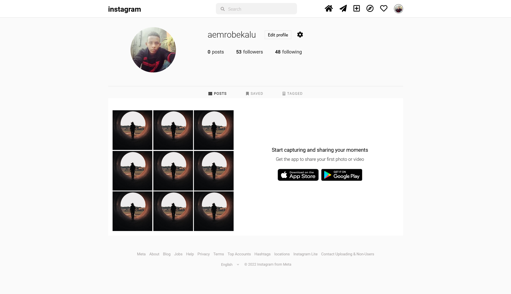
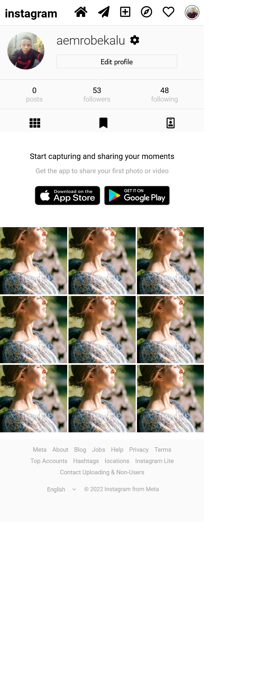

# cloning instagram profile section

## Table of contents

- [Overview](#overview)
  - [The challenge](#the-challenge)
  - [Screenshot](#screenshot)
  - [Links](#links)
- [My process](#my-process)
  - [Built with](#built-with)
  - [What I learned](#what-i-learned)
  - [Continued development](#continued-development)
- [Author](#author)
- [Acknowledgments](#acknowledgments)

## Overview

### The challenge

- cloning the instagram profile section

### Screenshot

### Links

- Live Site URL: [ live site URL](https://aemrobe.github.io/instagram-profile-clone/)

## My process

### Built with

- Semantic HTML5 markup
- CSS custom properties
- Flexbox
  -css grid
- Mobile-first workflow

### What I learned

in this challenge I use my flexbox and grid skill into practice. I reinforce my knowledge of flexbox and grid skills which I Knew.

### Continued development

I want to master my skill of using flexbox and grid for responsive webdesign and I want to learn javascript.

## Author

- Frontend Mentor - [@aemrobe](https://www.frontendmentor.io/profile/aemrobe)
- Twitter - [@Aemro112](https://www.twitter.com/Aemro112)

## Acknowledgments

I want to say thanks to my team members who always helped me in fixing the bugs which I encounter whey I make this challenges.
